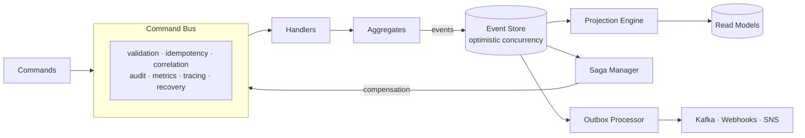

# go-mink 🦫

**The batteries-included Event Sourcing & CQRS toolkit for Go.**

<p align="center">
  <a href="https://pkg.go.dev/go-mink.dev"></a>
  <a href="https://goreportcard.com/report/go-mink.dev"></a>
  <a href="https://github.com/AshkanYarmoradi/go-mink/actions/workflows/test.yml"></a>
  <a href="https://codecov.io/gh/AshkanYarmoradi/go-mink"></a>
  <a href="LICENSE"></a>
  <a href="https://go.dev/"></a>
</p>

<p align="center">
  <a href="https://sonarcloud.io/summary/new_code?id=AshkanYarmoradi_go-mink"></a>
  <a href="https://sonarcloud.io/summary/new_code?id=AshkanYarmoradi_go-mink"></a>
  <a href="https://sonarcloud.io/summary/new_code?id=AshkanYarmoradi_go-mink"></a>
  <a href="https://sonarcloud.io/summary/new_code?id=AshkanYarmoradi_go-mink"></a>
</p>

<p align="center">
  <b><a href="https://go-mink.dev">📖 Documentation</a></b> ·
  <a href="https://go-mink.dev/docs/tutorial/setup">🎓 Tutorial</a> ·
  <a href="examples/">💡 Examples</a> ·
  <a href="https://pkg.go.dev/go-mink.dev">🔎 API Reference</a> ·
  <a href="https://go-mink.dev/docs/roadmap">🗺️ Roadmap</a>
</p>

---

`go-mink` lets you build event-sourced systems in Go without the usual boilerplate. Instead of storing *current state*, it stores every change as an immutable event and rebuilds state by replaying them — giving you a perfect audit log, time travel, and read models for free. It's inspired by [MartenDB](https://martendb.io/) for .NET and ships with everything you need to go from prototype to production: a pluggable event store, a CQRS command bus, projections, sagas, an outbox, field-level encryption, and a full GDPR toolkit.

```go
// Model your domain as events — go-mink handles the rest.
order := NewOrder("order-123")
order.Create("customer-456")
order.AddItem("SKU-001", 2, 29.99)

store.SaveAggregate(ctx, order)              // append events, optimistic concurrency
loaded := NewOrder("order-123")
store.LoadAggregate(ctx, loaded)             // rebuild state by replaying events
```

> **Why "go-mink"?** Marten (the animal) inspired the .NET library's name, so we picked the mink — another member of the *Mustelidae* family — for its Go cousin. 🦫

## Table of Contents

- [Why Event Sourcing?](#why-event-sourcing)
- [Features](#features)
- [Installation](#installation)
- [Quick Start](#quick-start)
- [How It Fits Together](#how-it-fits-together)
- [Guided Tour](#guided-tour) — CQRS · Projections · Sagas · Outbox · Versioning · Encryption · GDPR · Observability · Testing
- [Examples](#examples)
- [Performance](#performance)
- [Documentation](#documentation)
- [Project Status](#project-status)
- [Contributing](#contributing)
- [Community & Support](#community--support)
- [License](#license)

## Why Event Sourcing?

Traditional CRUD apps overwrite data — the moment you `UPDATE` a row, the previous state is gone. Event sourcing keeps the *entire history* as an append-only log of facts. That single change unlocks a lot:

- **🕰️ Complete audit trail** — every state change is a durable, timestamped fact. Answer "who changed what, when, and why?" without bolt-on logging.
- **⏪ Time travel & debugging** — replay a stream to any point in time to see exactly how a bug happened.
- **📊 Purpose-built read models** — project the same events into as many optimized query models as you need (CQRS), and rebuild them from scratch whenever your requirements change.
- **🔌 Natural integration** — events are a first-class integration point. Publish them reliably to Kafka, webhooks, or SNS with the built-in outbox.
- **🔐 Compliance by design** — with field-level encryption, crypto-shredding, and a GDPR erasure/export toolkit, "right to be forgotten" is a feature, not a project.

The catch is usually the plumbing: optimistic concurrency, serialization, schema evolution, projection checkpoints, idempotency, sagas. **go-mink is that plumbing** — production-tested, pluggable, and zero-overhead when a feature is unused — so you can focus on your domain.

> New to the pattern? Start with the [Introduction](https://go-mink.dev/docs/getting-started/introduction) and the [8-part Blog Series](https://go-mink.dev/docs/blog-series/introduction).

## Features

Everything below is included, works together, and is covered by tests (**CI enforces 90% coverage**).

| Area | What you get |
|------|--------------|
| 🎯 **Event Store** | Append-only storage, optimistic concurrency, global ordering, snapshots, catch-up subscriptions, **filtered feed reads** (by type / stream / category) |
| 🔌 **Adapters** | Production **PostgreSQL** adapter and an **in-memory** adapter for tests — swap with one line |
| 🧱 **Aggregates** | `AggregateBase` with event application & uncommitted-event tracking |
| 📋 **Command Bus** | Full CQRS dispatch with a composable **middleware** pipeline |
| 🧩 **Middleware** | Validation, recovery, logging, correlation/causation IDs, idempotency, timeout, metrics, tracing, audit |
| 📖 **Projections** | Inline (strong), async (eventual), and live (real-time) projections with checkpoints, pause/resume & rebuild |
| 📊 **Read Models** | Generic repository + fluent query builder (filter/order/paginate) over memory or PostgreSQL |
| 🔁 **Sagas** | Process managers for long-running workflows with automatic **compensation** and timeouts |
| 📤 **Outbox** | Transactional outbox for reliable publishing to **Webhook · Kafka · SNS**, with retry & dead-letter |
| 🔄 **Versioning** | Schema evolution via **upcasting** (zero DB migration) + a schema-compatibility registry |
| 📦 **Serializers** | JSON (default), **MessagePack**, and **Protobuf** |
| 🔐 **Encryption** | Field-level encryption via **AWS KMS · HashiCorp Vault · local AES-256-GCM** (envelope encryption, per-tenant keys) |
| 🧹 **GDPR Toolkit** | Data **export** (Art. 15/20), **erasure** (Art. 17) via crypto-shredding, **retention** policies, **anonymization**, subject discovery |
| 📝 **Audit Logging** | Immutable, queryable audit trail of every command (who/what/when/outcome) |
| 📈 **Observability** | First-class **Prometheus** metrics and **OpenTelemetry** tracing |
| 🛠️ **CLI** | `mink` — project init, code generation, migrations, projection & stream inspection, diagnostics, GDPR ops |
| 🧪 **Testing** | BDD fixtures, event assertions, projection/saga test harnesses, and Docker test containers |

## Installation

Requires **Go 1.25+** (matches `go.mod`; CI builds on Go 1.25 and 1.26).

```bash
go get go-mink.dev                      # core library (memory adapter included)
go get go-mink.dev/adapters/postgres    # PostgreSQL adapter for production
```

Optionally grab the `mink` CLI for scaffolding and operations:

```bash
go install go-mink.dev/cmd/mink@latest
mink --help
```

## Quick Start

Define events, model an aggregate, and let the store persist and replay them. This runs against the in-memory adapter — no infrastructure required.

```go
package main

import (
	"context"
	"fmt"

	"go-mink.dev"
	"go-mink.dev/adapters/memory"
)

// 1. Events are plain structs — the immutable facts of your domain.
type OrderCreated struct{ OrderID, CustomerID string }
type ItemAdded struct {
	OrderID string
	SKU     string
	Qty     int
}

// 2. An aggregate embeds AggregateBase and applies events to build state.
type Order struct {
	mink.AggregateBase
	CustomerID string
	Items      int
}

func NewOrder(id string) *Order {
	o := &Order{}
	o.SetID(id)
	o.SetType("Order")
	return o
}

func (o *Order) Create(customerID string) {
	o.Apply(OrderCreated{OrderID: o.AggregateID(), CustomerID: customerID})
}

func (o *Order) AddItem(sku string, qty int) {
	o.Apply(ItemAdded{OrderID: o.AggregateID(), SKU: sku, Qty: qty})
}

// ApplyEvent mutates state — called both for new and replayed events.
func (o *Order) ApplyEvent(event interface{}) error {
	switch e := event.(type) {
	case OrderCreated:
		o.CustomerID = e.CustomerID
	case ItemAdded:
		o.Items += e.Qty
	}
	return nil
}

func main() {
	ctx := context.Background()
	store := mink.New(memory.NewAdapter())
	store.RegisterEvents(OrderCreated{}, ItemAdded{})

	// Write: emit events and persist them.
	order := NewOrder("order-123")
	order.Create("customer-456")
	order.AddItem("SKU-001", 2)
	if err := store.SaveAggregate(ctx, order); err != nil {
		panic(err)
	}

	// Read: rebuild state by replaying the stream.
	loaded := NewOrder("order-123")
	if err := store.LoadAggregate(ctx, loaded); err != nil {
		panic(err)
	}
	fmt.Printf("Order for %s has %d items (v%d)\n",
		loaded.CustomerID, loaded.Items, loaded.Version())
	// → Order for customer-456 has 2 items (v2)
}
```

**Going to production?** Swap the adapter — everything else stays the same:

```go
adapter, _ := postgres.NewAdapter("postgres://localhost/mydb")
defer adapter.Close()
store := mink.New(adapter)
```

The PostgreSQL adapter auto-creates its schema (`streams` + `events`, plus `snapshots`/`checkpoints`) on first use. See the [Event Store guide](https://go-mink.dev/docs/core/event-store).

## How It Fits Together

Commands flow through a middleware pipeline into handlers that load aggregates and emit events. The event store is the source of truth; projections, sagas, and the outbox all react to the same durable log.



- **Command Bus** dispatches commands through middleware to handlers ([`bus.go`](bus.go), [`middleware.go`](middleware.go)).
- **Aggregates** run domain logic and produce events ([`aggregate.go`](aggregate.go)).
- **Event Store** appends events with optimistic concurrency and replays them ([`store.go`](store.go)).
- **Projection Engine** builds read models — inline, async, or live ([`projection_engine.go`](projection_engine.go)).
- **Saga Manager** orchestrates multi-step workflows and compensates on failure ([`saga_manager.go`](saga_manager.go)).
- **Outbox Processor** reliably publishes events to external systems ([`outbox_processor.go`](outbox_processor.go)).

Full write-up in the [Architecture guide](https://go-mink.dev/docs/getting-started/architecture).

## Guided Tour

<details>
<summary><b>⚙️ CQRS with the Command Bus</b></summary>

```go
// Commands are validated, deduplicated intents.
type CreateOrder struct {
	mink.CommandBase
	CustomerID string `json:"customerId"`
}

func (c CreateOrder) CommandType() string { return "CreateOrder" }
func (c CreateOrder) Validate() error {
	if c.CustomerID == "" {
		return mink.NewValidationError("CreateOrder", "CustomerID", "required")
	}
	return nil
}

bus := mink.NewCommandBus()
bus.Use(mink.RecoveryMiddleware())        // panics → errors
bus.Use(mink.ValidationMiddleware())      // reject invalid commands
bus.Use(mink.CorrelationIDMiddleware(nil))

// Idempotency: the same command is processed exactly once.
idem := memory.NewIdempotencyStore()
bus.Use(mink.IdempotencyMiddleware(mink.DefaultIdempotencyConfig(idem)))

bus.RegisterFunc("CreateOrder", func(ctx context.Context, cmd mink.Command) (mink.CommandResult, error) {
	c := cmd.(CreateOrder)
	// load aggregate, run domain logic, save events...
	return mink.NewSuccessResult("order-123", 1), nil
})

result, err := bus.Dispatch(ctx, CreateOrder{CustomerID: "cust-456"})
```

See the [`cqrs`](examples/cqrs) example and the [Advanced Patterns guide](https://go-mink.dev/docs/advanced/advanced-patterns).
</details>

<details>
<summary><b>📖 Projections & Read Models</b></summary>

```go
type OrderSummary struct {
	OrderID   string
	Status    string
	ItemCount int
	Total     float64
}

type OrderSummaryProjection struct {
	mink.ProjectionBase
	repo *mink.InMemoryRepository[OrderSummary]
}

func (p *OrderSummaryProjection) Apply(ctx context.Context, e mink.StoredEvent) error {
	// transform events into read-model updates...
	return nil
}

engine := mink.NewProjectionEngine(store, mink.WithCheckpointStore(memory.NewCheckpointStore()))
engine.RegisterInline(&OrderSummaryProjection{repo: repo})
engine.Start(ctx)
defer engine.Stop(ctx)

// Query with the fluent builder.
orders, _ := repo.Find(ctx, mink.NewQuery().
	Where("Status", mink.FilterOpEq, "Pending").
	OrderByDesc("Total").
	WithLimit(10))

// Rebuild from scratch whenever requirements change.
mink.NewProjectionRebuilder(store, checkpointStore).
	RebuildInline(ctx, projection, mink.RebuildOptions{BatchSize: 1000})
```

See the [`projections`](examples/projections) example and the [Read Models guide](https://go-mink.dev/docs/core/read-models).
</details>

<details>
<summary><b>🔁 Sagas / Process Managers</b></summary>

Orchestrate multi-step workflows that span aggregates, with automatic compensation when a step fails.

```go
type OrderFulfillmentSaga struct {
	mink.SagaBase
	PaymentID   string
	ShipmentID  string
}

// React to events by emitting the next command; compensate on failure.
func (s *OrderFulfillmentSaga) HandleEvent(ctx context.Context, e mink.StoredEvent) ([]mink.Command, error) {
	switch e.Type {
	case "OrderPlaced":
		return []mink.Command{ProcessPayment{...}}, nil
	case "PaymentFailed":
		return []mink.Command{CancelOrder{...}}, nil // compensation
	}
	return nil, nil
}
```

See the [`sagas`](examples/sagas) example and the [Sagas section](https://go-mink.dev/docs/advanced/advanced-patterns).
</details>

<details>
<summary><b>📤 Outbox — reliable publishing to Kafka / Webhooks / SNS</b></summary>

```go
outboxStore := memory.NewOutboxStore()
es := mink.NewEventStoreWithOutbox(store, outboxStore, []mink.OutboxRoute{
	{EventTypes: []string{"OrderCreated"}, Destination: "webhook:https://partner.example.com/events"},
	{Destination: "kafka:all-events"}, // every event
})

// Events and outbox messages are written atomically.
es.Append(ctx, "Order-123", []interface{}{OrderCreated{OrderID: "123"}})

// A background processor delivers them with retry + dead-letter.
processor := mink.NewOutboxProcessor(outboxStore,
	mink.WithPublisher(webhook.New()),
	mink.WithPollInterval(time.Second),
)
processor.Start(ctx)
defer processor.Stop(ctx)
```

Publishers: [`outbox/webhook`](outbox/webhook), [`outbox/kafka`](outbox/kafka), [`outbox/sns`](outbox/sns).
</details>

<details>
<summary><b>🔄 Event Versioning & Upcasting (zero DB migration)</b></summary>

```go
// Upcast v1 → v2 by adding a default Currency field.
type orderCreatedV1ToV2 struct{}

func (u orderCreatedV1ToV2) EventType() string { return "OrderCreated" }
func (u orderCreatedV1ToV2) FromVersion() int  { return 1 }
func (u orderCreatedV1ToV2) ToVersion() int    { return 2 }
func (u orderCreatedV1ToV2) Upcast(data []byte, m mink.Metadata) ([]byte, error) {
	var obj map[string]interface{}
	json.Unmarshal(data, &obj)
	obj["currency"] = "USD"
	return json.Marshal(obj)
}

chain := mink.NewUpcasterChain()
chain.Register(orderCreatedV1ToV2{})
store := mink.New(adapter, mink.WithUpcasters(chain))
// Old events are upcasted transparently on Load — the schema version lives in metadata.
```

See the [`versioning`](examples/versioning) example and the [Versioning guide](https://go-mink.dev/docs/advanced/versioning).
</details>

<details>
<summary><b>🔐 Field-Level Encryption & Crypto-Shredding</b></summary>

```go
provider, _ := local.New(local.WithKey("master-1", myKey)) // KMS/Vault in production
defer provider.Close()

encConfig := mink.NewFieldEncryptionConfig(
	mink.WithEncryptionProvider(provider),
	mink.WithDefaultKeyID("master-1"),
	mink.WithEncryptedFields("CustomerCreated", "email", "phone", "ssn"),
	mink.WithTenantKeyResolver(func(tenantID string) string { return "tenant-" + tenantID }),
)

store := mink.New(adapter, mink.WithFieldEncryption(encConfig))
// PII is encrypted at rest and decrypted transparently on load.
// Revoking a key makes that data permanently unrecoverable — GDPR crypto-shredding.
store.EncryptionConfig().RevokeKey("tenant-42")
```

Providers: [`encryption/local`](encryption/local), [`encryption/kms`](encryption/kms), [`encryption/vault`](encryption/vault). See the [Security guide](https://go-mink.dev/docs/advanced/security).
</details>

<details>
<summary><b>🧹 GDPR — Export, Erasure & Retention</b></summary>

go-mink treats data governance as a first-class concern.

```go
// Right to access / portability (Article 15 & 20)
exporter := mink.NewDataExporter(store)
result, _ := exporter.Export(ctx, mink.ExportRequest{
	SubjectID: "user-123",
	Filter:    mink.FilterByUserID("user-123"),
})

// Right to erasure (Article 17) — one call: revoke keys, redact read models,
// run external-PII hooks, and emit a verifiable erasure certificate.
eraser := mink.NewDataEraser(store,
	mink.WithEraseSubjectResolver(resolver),
	mink.WithSharedKeyGuard(),                 // don't nuke a shared tenant key
	mink.WithReadModelRedactor(readModels...),
	mink.WithSubjectStore(mink.NewAuditSubjectEraser(auditStore)),
)
res, _ := eraser.Erase(ctx, mink.ErasureRequest{SubjectID: "user-123"})

// Scheduled retention: shred / redact / anonymize by age, category, or tenant.
rm := mink.NewRetentionManager(store, []mink.RetentionPolicy{
	{Name: "shred-old-pii", Category: "user", MaxAge: 365 * 24 * time.Hour, Action: mink.ActionShred},
})
report, _ := rm.Apply(ctx)
```

Explore [`export`](examples/export) & [`encryption`](examples/encryption), or read the [Security & GDPR guide](https://go-mink.dev/docs/security). The `mink gdpr` CLI can `discover`, `verify`, `erase`, and dry-run `retain`.
</details>

<details>
<summary><b>📝 Audit Logging</b></summary>

```go
auditStore := memory.NewAuditStore() // PostgreSQL store for production
bus.Use(mink.AuditMiddleware(mink.DefaultAuditConfig(auditStore)))

ctx = mink.WithActor(ctx, "alice@example.com")
bus.Dispatch(ctx, cmd) // records who/what/when/outcome, immutably

entries, _ := auditStore.Find(ctx, mink.AuditQuery{CommandType: "WithdrawFunds"})
```

See the [`audit`](examples/audit) example and the [Audit Logging guide](https://go-mink.dev/docs/advanced/audit-logging).
</details>

<details>
<summary><b>📈 Observability — Prometheus & OpenTelemetry</b></summary>

```go
// Prometheus metrics
m := metrics.New(metrics.WithMetricsServiceName("order-service"))
bus.Use(m.CommandMiddleware())

// OpenTelemetry tracing
tracer := tracing.NewTracer(tracing.WithServiceName("order-service"))
bus.Use(tracing.CommandMiddleware(tracer))
```

See the [`metrics`](examples/metrics) & [`tracing`](examples/tracing) examples.
</details>

<details>
<summary><b>🧪 Testing utilities</b></summary>

```go
// BDD-style aggregate tests: Given → When → Then
bdd.Given(t, NewOrder("order-123")).
	When(func() error { return order.Create("customer-456") }).
	Then(OrderCreated{OrderID: "order-123", CustomerID: "customer-456"})

// Fluent event assertions
assertions.AssertEventTypes(t, events, "OrderCreated", "ItemAdded")

// Real PostgreSQL in tests via containers
container := containers.StartPostgres(t)
db := container.MustDB(ctx)
```

See the [`bdd-testing`](examples/bdd-testing) example and the [Testing guide](https://go-mink.dev/docs/guide/testing).
</details>

## Examples

Fifteen runnable, self-contained examples live in [`examples/`](examples/) — each with its own README. Most need **zero infrastructure** (`go run ./examples/<name>`); two use PostgreSQL via `docker compose`.

| Example | Demonstrates | Infra |
|---------|--------------|:-----:|
| [basic](examples/basic) | Minimal event sourcing: events, aggregates, save/load | — |
| [cqrs](examples/cqrs) | Command bus + full middleware pipeline | — |
| [cqrs-postgres](examples/cqrs-postgres) | CQRS backed by PostgreSQL | 🐘 |
| [projections](examples/projections) | Inline & live read models, query builder | — |
| [sagas](examples/sagas) | Process manager with compensation | — |
| [versioning](examples/versioning) | Schema evolution via upcasting (v1→v2→v3) | — |
| [encryption](examples/encryption) | Field-level encryption + crypto-shredding | — |
| [export](examples/export) | GDPR data export strategies | — |
| [audit](examples/audit) | Command audit-logging middleware | — |
| [metrics](examples/metrics) | Prometheus instrumentation | — |
| [tracing](examples/tracing) | OpenTelemetry distributed tracing | — |
| [msgpack](examples/msgpack) | MessagePack serialization | — |
| [protobuf](examples/protobuf) | Protobuf serialization | — |
| [bdd-testing](examples/bdd-testing) | Given/When/Then aggregate testing | — |
| [full-ecommerce](examples/full-ecommerce) | **Everything together** — a realistic system | 🐘 |

New here? Read [`basic`](examples/basic) → [`cqrs`](examples/cqrs) → [`projections`](examples/projections) → [`full-ecommerce`](examples/full-ecommerce).

## Performance

go-mink is benchmarked on every commit with a shared adapter benchmark suite. Representative figures from CI (`ubuntu-latest`):

| Adapter | Append (single) | Append (batch 100) | Load (1000 events) | Concurrent (8 workers) |
|---------|-----------------|--------------------|--------------------|------------------------|
| **Memory** | ~2.5M events/sec | ~6M events/sec | ~60M events/sec | ~1.5M events/sec |
| **PostgreSQL** | ~5K events/sec | ~30K events/sec | ~300K events/sec | ~15K events/sec |

Scale tests: the memory adapter processes **1M events** in under a second; the PostgreSQL adapter handles **100K events** with p99 append latency under 2 ms.

```bash
make benchmark-adapters      # memory adapter (no infra)
make benchmark-adapters-pg   # PostgreSQL adapter (needs infra)
```

Details, latency percentiles, and a guide for benchmarking new adapters: [Benchmarks](https://go-mink.dev/docs/guide/benchmarks).

## Documentation

Full documentation lives at **[go-mink.dev](https://go-mink.dev)**.

| | |
|---|---|
| 🚀 **Get started** | [Introduction](https://go-mink.dev/docs/getting-started/introduction) · [Architecture](https://go-mink.dev/docs/getting-started/architecture) · [Tutorial](https://go-mink.dev/docs/tutorial/setup) |
| 🧠 **Core concepts** | [Event Store](https://go-mink.dev/docs/core/event-store) · [Read Models](https://go-mink.dev/docs/core/read-models) · [Adapters](https://go-mink.dev/docs/core/adapters) |
| 🔬 **Advanced** | [Advanced Patterns](https://go-mink.dev/docs/advanced/advanced-patterns) · [Versioning](https://go-mink.dev/docs/advanced/versioning) · [Security & GDPR](https://go-mink.dev/docs/advanced/security) · [Audit Logging](https://go-mink.dev/docs/advanced/audit-logging) · [API Design](https://go-mink.dev/docs/advanced/api-design) |
| 🛠️ **Guides** | [CLI](https://go-mink.dev/docs/guide/cli) · [Testing](https://go-mink.dev/docs/guide/testing) · [Benchmarks](https://go-mink.dev/docs/guide/benchmarks) |
| 📚 **Learn by reading** | [Blog Series](https://go-mink.dev/docs/blog-series/introduction) · [Architecture Decision Records](https://go-mink.dev/docs/adr/) · [Roadmap](https://go-mink.dev/docs/roadmap) |
| 🔎 **Reference** | [pkg.go.dev/go-mink.dev](https://pkg.go.dev/go-mink.dev) |

## Project Status

**Current release: [v1.0.0](CHANGELOG.md) — stable.** All core features are complete and the public API is stable under [Semantic Versioning](https://semver.org/). Active development continues on the `develop` branch (see the [roadmap](https://go-mink.dev/docs/roadmap) and [CHANGELOG](CHANGELOG.md)).

Releases are automated: every merge to `develop` publishes a release candidate (`v1.0.4-rc.1`, …), and merging `develop` into `main` cuts the next stable release. Opt into an RC with `go get go-mink.dev@v1.0.4-rc.1`.

## Contributing

Contributions are very welcome — whether it's a bug report, a docs fix, a new adapter, or a feature. 🙌

1. Read the [Contributing Guide](CONTRIBUTING.md) and [Code of Conduct](CODE_OF_CONDUCT.md).
2. Branch from `develop` (`feature/your-thing` or `fix/your-thing`).
3. Write tests (we hold **90%+ coverage**) and run the checks below.
4. Open a PR against `develop` with a clear description.

```bash
make test-unit     # fast unit tests, no infrastructure needed
make test          # full suite (auto-starts PostgreSQL + Kafka via docker-compose)
make lint          # golangci-lint
make fmt           # go fmt ./...
```

**Great first contributions:** try an example, improve a doc page, add a benchmark, or implement an [`EventStoreAdapter`](adapters/adapter.go) for your favorite database. Browse [good first issues](https://github.com/AshkanYarmoradi/go-mink/labels/good%20first%20issue) to get started.

## Community & Support

- 💬 [**GitHub Discussions**](https://github.com/AshkanYarmoradi/go-mink/discussions) — questions, ideas, and show-and-tell
- 🐛 [**Issues**](https://github.com/AshkanYarmoradi/go-mink/issues) — bugs and feature requests
- 🔐 [**Security Policy**](.github/SECURITY.md) — report vulnerabilities privately
- ⭐ **Star the repo** if go-mink is useful to you — it genuinely helps others discover it.

## License

[Apache License 2.0](LICENSE) © go-mink contributors.

---

<p align="center"><b>go-mink</b> — Event Sourcing for Go, done right. 🦫</p>
